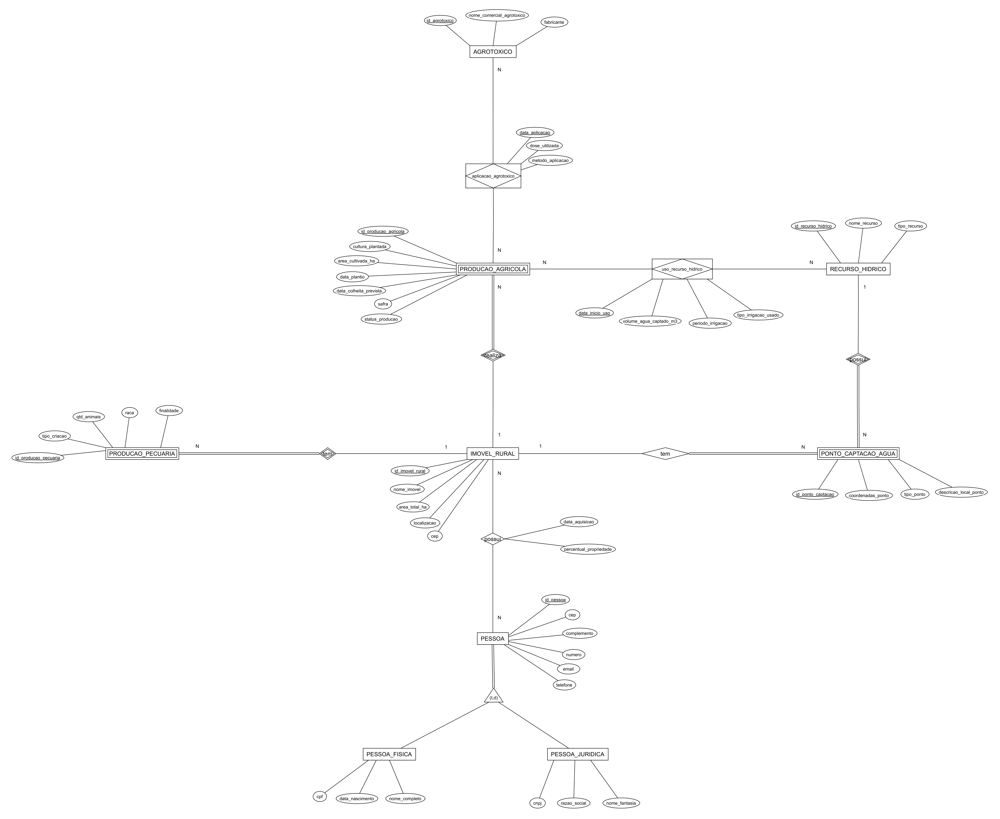
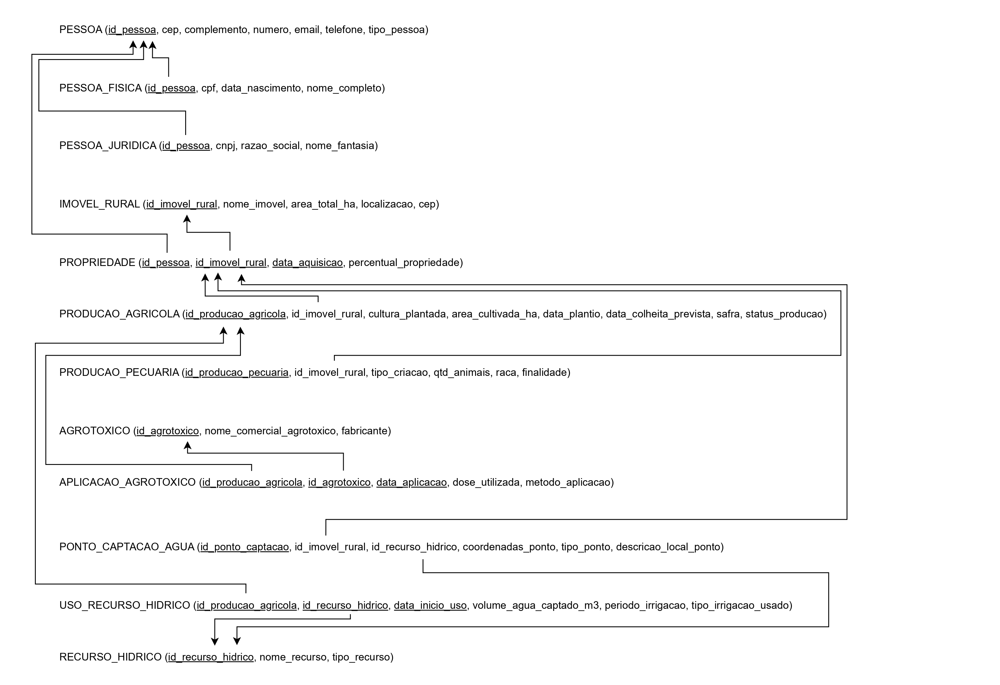

# 🚀 Portal da Agricultura e Meio Ambiente (PIBD)

## 📝 Visão Geral do Projeto

Este repositório contém a implementação de um subsistema de gestão para um "Portal da Agricultura e Meio Ambiente", desenvolvido como parte da disciplina de **Projeto e Implementação de Banco de Dados (PIBD)**.

O projeto consiste em duas partes principais:
1.  Um **banco de dados PostgreSQL**, modelado para armazenar informações sobre propriedades rurais, produções agrícolas e pecuárias, uso de recursos hídricos e agrotóxicos.
2.  Uma **aplicação de console (CLI) em Python** que interage com o banco de dados para executar funcionalidades essenciais do sistema.

---

## ✨ Funcionalidades da Aplicação

A aplicação de console implementa as seguintes funcionalidades:

*   **Cadastro de Nova Produção Agrícola:** Permite registrar um novo cultivo (ex: Soja, Milho) em uma propriedade rural existente, validando os dados de entrada.
*   **Geração de Relatório de Proprietários:** Exibe um relatório consolidado que lista todos os imóveis rurais e seus respectivos proprietários (pessoas físicas e jurídicas), com o percentual de posse.
*   **Interface de Menu Interativa:** Proporciona uma experiência de usuário simples e direta para navegar entre as funcionalidades.

---

## 💻 Tecnologias Utilizadas

*   **Linguagem:** Python 3
*   **Banco de Dados:** PostgreSQL
*   **API de Conexão (Driver):** `psycopg2-binary`

---

## 📂 Estrutura do Repositório

```
.
├── app_agricultura.py    # O código-fonte principal da aplicação em Python.
├── script_completo.sql   # Script SQL único para criar e popular todo o banco de dados.
├── DER.png               # Imagem do Diagrama Entidade-Relacionamento.
├── EsquemaRelacional.jpg # Imagem do Esquema Lógico Relacional.
├── requirements.txt      # Arquivo com as dependências Python do projeto.
└── README.md             # Este arquivo.
```

---

## 🔧 Guia de Instalação e Execução

Siga os passos abaixo para configurar e executar o projeto em seu ambiente local.

### 1. Pré-requisitos

*   **Python 3.8** ou superior.
*   **PostgreSQL** instalado e em execução.
*   **Git** para clonar o repositório.

### 2. Clonar o Repositório

```bash
git clone https://github.com/gustavodsg/app_agricultura.git
cd app_agricultura
```

### 3. Configuração do Banco de Dados

1.  **Acesse o `psql`** como superusuário (geralmente `postgres`):
    ```bash
    psql -U postgres
    ```

2.  **Crie o banco de dados** para o projeto:
    ```sql
    CREATE DATABASE db_agricultura_sc;
    ```

3.  **Conecte-se ao novo banco de dados** e execute o script de setup:
    ```sql
    \c db_agricultura_sc
    \i script_completo.sql
    ```
    Isso criará todas as tabelas, índices, funções e inserirá os dados de teste.

4.  **Saia do `psql`**:
    ```sql
    \q
    ```

### 4. Configuração do Ambiente Python

1.  **Crie e ative um ambiente virtual** (altamente recomendado):
    ```bash
    # No Windows
    python -m venv venv
    .\venv\Scripts\activate

    # No macOS/Linux
    python3 -m venv venv
    source venv/bin/activate
    ```

2.  **Instale as dependências** do projeto:
    ```bash
    pip install -r requirements.txt
    ```
    
### 5. Configuração da Aplicação

1.  **Abra o arquivo `app_agricultura.py`** em um editor de texto.
2.  **Edite o dicionário `DB_CONFIG`** com suas credenciais do PostgreSQL, especialmente a senha:
    ```python
    DB_CONFIG = {
        "dbname": "db_agricultura_sc",
        "user": "postgres",
        "password": "SUA_SENHA_AQUI", # <-- ATUALIZE AQUI
        "host": "localhost",
        "port": "5432"
    }
    ```

### 6. Executar a Aplicação

Com o ambiente virtual ativado, execute o seguinte comando no terminal:
```bash
python app_agricultura.py
```
O menu interativo da aplicação será exibido, e você poderá testar as funcionalidades.

---

## 🏛️ Modelo do Banco de Dados

### Diagrama Entidade-Relacionamento (DER)


### Esquema Lógico Relacional


---

## 👨‍💻 Autor

*   **Gustavo da Silva Garcia** - RA 822522

---

## 📄 Licença

Este projeto é distribuído sob a licença GPL. Veja o arquivo `LICENSE` para mais detalhes.
